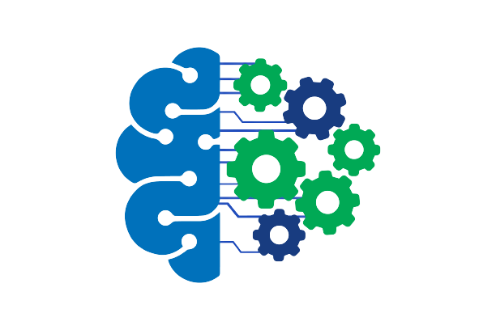

# Machine Learning Streamlit App



## Table of Contents
1. [Introduction](#introduction)
2. [Getting Started](#getting-started)
3. [Exploratory Data Analysis](#exploratory-data-analysis)
4. [Machine Learning](#machine-learning)
5. [Requirements](#requirements)

## Introduction
Welcome to the Machine Learning Streamlit App! This application is designed to help you with various machine learning tasks, including data exploration (Exploratory Data Analysis) and building predictive models. It offers a user-friendly interface for both data scientists and enthusiasts to analyze and model data easily.

## Getting Started
To get started with the Machine Learning Streamlit App, follow these steps:

1. Clone this repository to your local machine:
   ```bash
   git clone https://github.com/yourusername/your-repo.git
   cd your-repo


Install the required Python packages:

bash
Copy code
pip install -r requirements.txt
Run the Streamlit app:

bash
Copy code
streamlit run your_app.py
Open your web browser and navigate to http://localhost:8501.

## Exploratory Data Analysis
The Exploratory Data Analysis (EDA) section provides essential tools for understanding your dataset:

View the dataset's shape.
Identify and remove duplicate values.
Check for missing data and handle it.
Explore the columns in your dataset.
Visualize data using pie charts, bar plots, and feature comparisons.
Examine the correlation matrix to understand relationships between variables.
Machine Learning
The Machine Learning section of the app guides you through the model-building process:

Preprocess your data by removing columns, handling null values, encoding categorical features, and scaling numeric features.
Select from a range of machine learning models, including Logistic Regression, Decision Tree, Support Vector Machine (SVM), Random Forest, XGBoost, and Gradient Boosting.
Evaluate your selected model's performance with accuracy, classification report, and a confusion matrix.
